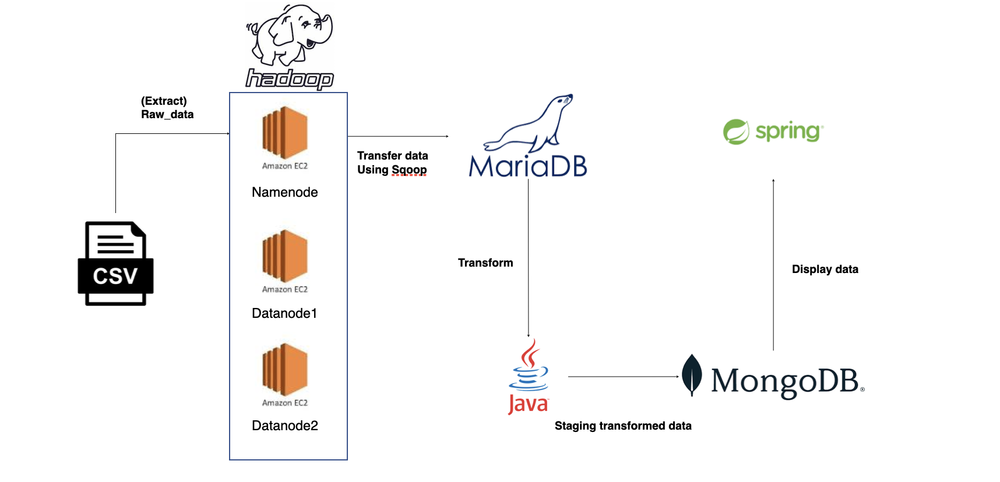
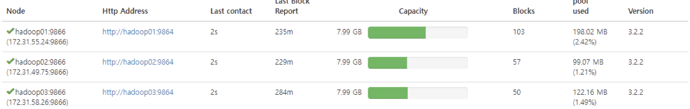
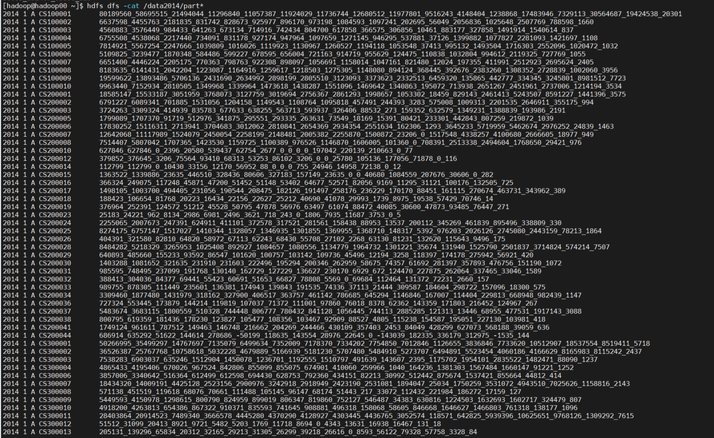
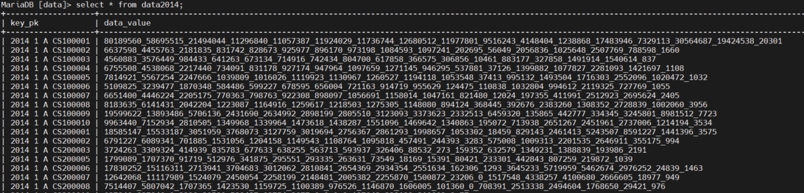
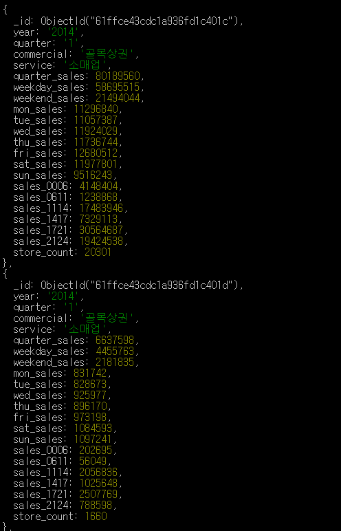

# 4조 그래도(그래 내일을 위해 도전하는거야!) - Hadoop 프로젝트

## 프로젝트 주제 : 서울시 우리마을 가게 상권 추정매출을 이용한 분기별 추정 매출 보고서

### **조원 : 이현민, 정준영, 김범석,박민규**

- 역할
    - 이현민(조장) : 데이터 파이프라인 구축 담당
    - 박민규(조원) : 데이터 파이프라인 구축 담당
    - 정준영(조원) : Spring을 이용한 백엔드 담당
    - 김범석(조원) : BootStrap을 활용한 프론트엔드 담당
- 프로젝트 목표
    - Hadoop MapReduce를 이용하여 집계 데이터 넣기
    - Sqoop을 이용하여 MariaDB로 Export
    - Spring을 이용해 몽고DB 데이터를 그래프로 표현
    - BootStrap과 Chart.js를 이용해 웹 화면 구성
- DataFlow
    
   
    
- Spring을 통한 Web 구현
    

    
    
    - AWS EC2
        - 하둡 3.2.2
            - 완전 분산 모드로 진행
            - 1개의  name node
            - 3개의 data node
            - 클러스터 구성
            
            
			
			- Mapreduce 사용 명령어

					$ hadoop jar ~/data/final2.jar hdfs.salesmain /data/data2020.csv /data2020
                
            - HDFS 파일 예시
                
               
    
                
        - MariaDB
            - Sqoop 명령어
				
					$ sqoop export --connect "jdbc:mysql://localhost:3306/data?useUnicode=true&amp;characterEncoding=UTF-8" --table data2020 --username "root" --password "1234" -m 1 --export-dir /data2020/part-r-00000 --direct

 
            - DataNode에 존재하는 HDFS 파일을 Sqoop을 활용해 MariaDB로 데이터 이동
            
            
    
        - MongoDB
            - MariaDB에 있는 데이터를 자바를 이용해 정제한 후 로컬 환경에 설치되어 있는 MongoDB로 데이터 이동
            - MongoDB Collection
            
           

- git repository 디렉토리 구성
	- Data : Raw_data
	- MapReduce : Mapreduce와 관련된 JAR 파일과 해당 자바 파일
	- Maria_to_Mongo : EC2 내의 MariaDB에서 로컬 환경의 MongoDB로 데이터 전송을 할 때 쓰는 자바 프로젝트
	- FrontWeb : JavaScript에서 몽고DB의 데이터를 Aggregate해서 가져오는 것을 실패하여 사용하지 못했지만 프로젝트 중 구성했던 프론트엔드 디렉토리
	- Spring_Mongo : Spring 프로젝트
	- Markdown_Image : Markdown 이미지
